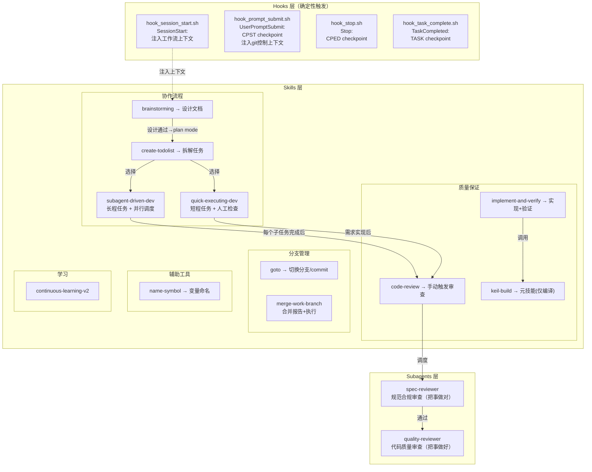
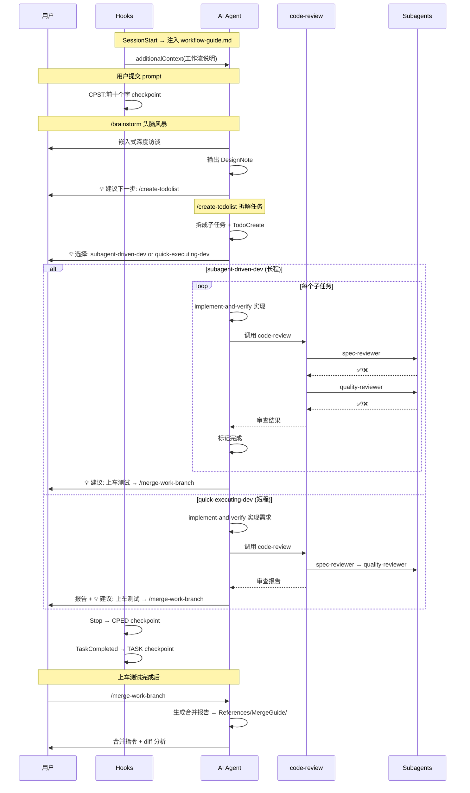

# AI 开发工作流系统 — 设计框架 v6

> 基于 Superpowers 4.3.1 大修大改，融合自定义分支管理方案。
>
> **语言规范**: 所有 skills、agents、hooks 中 AI 可见的提示词内容**必须使用准确的英文**，在不影响提示词质量的前提下**尽可能减少 token 使用**。本文档（中文）为设计参考，实际 SKILL.md / agent.md / hook 注入内容均为英文。

---

## 一、系统架构总览



---

## 二、现状 → 目标对照

### 删除项

| 删除目标 | 原因 |
|----------|------|
| [session-git-map.json](file:///e:/CODE_project/BalanceSoldier/ChassisControl/CHASSIS_Patience/.claude/session-git-map.json) + session-branch 映射功能 | 不保留此功能 |
| [hook_pre_tool.sh](file:///e:/CODE_project/BalanceSoldier/ChassisControl/CHASSIS_Patience/.claude/hooks/hook_pre_tool.sh) | checkpoint 已在 prompt_submit 和 stop 保证 |
| `fork-explore` skill | 暂不使用 |
| `writing-skills` skill | 暂不添加 |
| `dispatching-parallel-agents` skill | 整合到 subagent-driven-dev |
| Superpowers: `test-driven-development` | 嵌入式无法 TDD |
| Superpowers: `systematic-debugging` | 调试依赖人工 |
| Superpowers: `verification-before-completion` | 合并到 implement-and-verify |
| Superpowers: `using-git-worktrees` | 用 hooks 替代 |
| Superpowers: `using-superpowers` | 不保留入门引导 |

### 新建/适配项

| Superpowers 原名 | 目标名称 | 处理 |
|------------------|----------|------|
| `brainstorming` | `brainstorming` | 适配嵌入式 |
| `writing-plans` | `create-todolist` | 重命名，保留拆解大任务功能 |
| `subagent-driven-development` + `dispatching-parallel-agents` | `subagent-driven-dev` | 合并，含并行调度 |
| `executing-plans` | `quick-executing-dev` | 重命名 |
| `finishing-a-development-branch` + `merge` + `requesting-code-review`(合并部分) | `merge-work-branch` | 三合一 |
| `code-reviewer` agent | 拆为 `spec-reviewer` + `quality-reviewer` | 两个独立 subagent，由 code-review skill 调度 |
| — | `implement-and-verify` | 新建，合并 TDD+验证核心 |

---

## 三、Hooks 详细设计

> 官方文档确认：Stop payload 含 `last_assistant_message`，TaskCompleted 含 `task_subject`，UserPromptSubmit 含 `prompt`，SessionStart 支持 `additionalContext` 上下文注入。

### 3.1 [hook_session_start.sh](file:///e:/CODE_project/BalanceSoldier/ChassisControl/CHASSIS_Patience/.claude/hooks/hook_session_start.sh) — 重写为上下文注入

- **删除**: 现有的保护分支检查 + session-branch 映射逻辑
- **新功能**: 借鉴 Superpowers [session-start](file:///e:/CODE_project/BalanceSoldier/ChassisControl/CHASSIS_Patience/claude%20build%20resources/superpowers%204.3.1/hooks/session-start) hook 模式，通过 `additionalContext` 注入工作流使用说明
- **注入来源**: 读取 `.claude/hooks/workflow-guide.md` 文件内容，将其注入上下文
- **workflow-guide.md**: 单独的 md 文件，描述当前这个文档的工作流的使用方式，方便独立维护和修改
- 注入内容让 AI 了解工作流逻辑，但**不强制执行**
- **输出格式**:

  ```json
  {
    "hookSpecificOutput": {
      "hookEventName": "SessionStart",
      "additionalContext": "<workflow-guide.md 内容>"
    }
  }
  ```

### 3.2 [hook_prompt_submit.sh](file:///e:/CODE_project/BalanceSoldier/ChassisControl/CHASSIS_Patience/.claude/hooks/hook_prompt_submit.sh) — 签名 + 上下文注入

**Checkpoint 功能**:

- **现有**: `CP: Checkpoint before prompt: $PROMPT`
- **目标**: `CPST:用户提示词的前十个字`
- payload 字段: `prompt`
- 中文截取: 使用 awk/sed 处理 UTF-8 字符，一个汉字算一个字

**上下文注入功能（强制执行）**:

- 读取 `.claude/hooks/git-harness-agent-policy.md` 文件内容，通过 `additionalContext` 注入
- 内容来源: 基于 `提升AI编程可控性方案.md` 中的分支管理规则
- 注入的策略内容为**英文**，包括:
  - 保护分支检测 + 只读模式提示
  - 工作分支创建引导（`git checkout -b work/<name>`）
  - 禁止 `git worktree` 的硬性约束
- **git-harness-agent-policy.md**: 独立文件，存放在 hooks 目录下，方便修改
- 此注入为**强制执行**（非建议），AI 必须遵守分支保护策略

### 3.3 `hook_stop.sh` — 新建

- payload 字段: `last_assistant_message`
- 签名: `CPED:AI回答的前十个字`
- 纯脚本执行，无需 AI 智能层介入

### 3.4 `hook_task_complete.sh` — 新建

- payload 字段: `task_subject`、`task_description`
- **双重功能**:
  1. Git checkpoint 签名: `TASK:任务名称的前十个字`
  2. **更新 `plan-git-SHA.json`**: 读取当前分支最新 git SHA 和完成时间，写入对应 task 的 `head_sha` 和 `completed_at` 字段，将 task 状态改为 `completed`
- 匹配逻辑: 用 `task_subject` 匹配 plan-git-SHA.json 中于当前工作区同分支最新的 `in progress` plan 下的 task 名称
- 同时更新该 plan 的 `head_plan_sha` 为最新提交

> [!NOTE]
>
> plan的head是否在最后一个task完成后停止

### 3.5 settings.json hooks 配置

```json
{
  "hooks": {
    "SessionStart": [{ "matcher": "startup|resume|clear|compact",
      "hooks": [{ "type": "command", "command": ".claude/hooks/hook_session_start.sh" }] }],
    "UserPromptSubmit": [{ "matcher": "*",
      "hooks": [{ "type": "command", "command": ".claude/hooks/hook_prompt_submit.sh" }] }],
    "Stop": [{ "matcher": "*",
      "hooks": [{ "type": "command", "command": ".claude/hooks/hook_stop.sh", "async": true }] }],
    "TaskCompleted": [{ "matcher": "*",
      "hooks": [{ "type": "command", "command": ".claude/hooks/hook_task_complete.sh", "async": true }] }]
  }
}
```

> **新增文件**: `.claude/hooks/workflow-guide.md` — 推荐工作流说明文档，由 hook_session_start.sh 读取并注入
>
> `.claude/hooks/git-harness-agent-policy.md` — 强制git管控说明文档，由 hook_session_start.sh 读取并注入

---

## 四、Skills 详细设计

### 4.1 协作流程

#### `brainstorming`（从 Superpowers 适配）

- 增加嵌入式深度访谈阶段
- 如有相关控制理论参考资料，提醒用户提供（不自动搜索）
- 接口签名定义阶段引用 `name-symbol` skill
- 输出 → `References/DesignNote/YYYY-MM-DD-<topic>-design.md`
- **独立可调用**: 用户可单独使用 `/brainstorm` 只做设计
- **下一步建议**: 执行完成后给出明确指引 → 建议进入 plan mode 调用 `create-todolist`

#### `create-todolist`（重命名自 `writing-plans`）

- **保留原 writing-plans 核心功能**: 将大任务合理拆成合适的子任务（2-5分钟粒度），含完整文件路径、代码、验证步骤
- 使用官方 Todo 工具（`TaskCreate/TaskGet/TaskList/TaskUpdate`）
- **输出格式: JSON 文件**（非 md）
  - 路径: `References/PlanPrompt/YYYY-MM-DDThh-mm-<功能简述>.json`
  - 每个 task 独立条目，含任务说明、验收标准、文件路径、接口签名期望——供 spec-reviewer 脚本精准读取
- 任务步骤: 实现（implement-and-verify）→ keil-build → 可选 unit test
- **创建完成后自动初始化**:
  - 写入 `.claude/plan-git-SHA.json`（初始化新 plan 条目，base/head SHA 均设为当前最新提交）
- **独立可调用**: 用户可单独使用 `/create-todolist`
- **下一步建议**: 执行完成后提供 **subagent-driven-dev** vs **quick-executing-dev** 两种选择

**PlanPrompt JSON 示例**:

```json
{
  "plan_id": "YYYY-MM-DDThh-mm-<功能简述>",
  "description": "<该计划的核心目标描述，例如：实现机器人底盘LQR姿态控制算法>",
  "created_at": "YYYY-MM-DDThh:mm:ss+08:00",
  "tasks": [
    {
      "id": "Task_1",
      "name": "<子任务名称，简洁明确，例如：初始化底盘姿态传感器>",
      "description": "<子任务详细说明，包括要完成的具体操作、业务逻辑等>",
      "acceptance_criteria": [
        "<验收标准1，可量化，例如：编译通过 0 Error(s) 0 Warning(s)>",
        "<验收标准2，例如：MPU6050初始化函数返回值为0（成功）>",
        "<验收标准3，例如：姿态数据采样频率稳定在100Hz>"
      ],
      "files_to_modify": [
        "<待修改文件路径1，例如：Src/chassis_sensor.c>",
        "<待修改文件路径2，例如：Inc/chassis_sensor.h>"
      ],
      "interface_specs": {
        "functions": [
          "<函数签名1，例如：int MPU6050_Init(void)>",
          "<函数签名2，例如：void Chassis_Attitude_Sample(void)>"
        ],
        "structs": [
          "<结构体定义1，例如：ST_ChassisAttitude_t>",
          "<结构体定义2，例如：ST_MPU6050_Config_t>"
        ],
        "macros": [
          "<宏定义，可选，例如：#define MPU6050_SAMPLE_FREQ 100>"
        ],
        "enums": [
          "<枚举定义，可选，例如：ENUM_MPU6050_ErrorStatus_t>"
        ]
      }
    },
    {
      "id": "Task_2",
      "name": "<子任务名称，例如：实现LQR控制核心算法>",
      "description": "<子任务详细说明，例如：基于状态空间方程推导LQR增益矩阵，编写姿态控制计算函数>",
      "acceptance_criteria": [
        "<验收标准1，例如：LQR增益矩阵计算结果与理论值偏差≤5%>",
        "<验收标准2，例如：Chassis_LQR_Calc函数输出符合预期姿态指令>",
        "<验收标准3，例如：无内存越界、栈溢出风险>"
      ],
      "files_to_modify": [
        "<待修改文件路径，例如：Src/chassis_control.c>"
      ],
      "interface_specs": {
        "functions": [
          "<函数签名，例如：void Chassis_LQR_Calc(ST_ChassisAttitude_t *att, ST_ChassisCmd_t *cmd)>"
        ],
        "structs": [
          "<结构体定义，例如：ST_LQR_Params_t>"
        ],
        "global_vars": [
          "<全局变量，可选，例如：float LQR_K_Gain[4][2]>"
        ]
      }
    },
    {
      "id": "Task_3",
      "name": "<子任务名称，例如：集成测试与验证>",
      "description": "<子任务详细说明，例如：将传感器数据接入LQR算法，验证闭环控制效果>",
      "acceptance_criteria": [
        "<验收标准1，例如：底盘姿态误差≤±0.5°>",
        "<验收标准2，例如：keil-build编译无错误>",
        "<验收标准3，例如：无运行时断言失败>"
      ],
      "files_to_modify": [
        "<待修改文件路径，例如：Src/chassis_main.c>"
      ],
      "interface_specs": {
        "functions": [
          "<函数签名，例如：void Chassis_Control_Loop(void)>"
        ]
      }
    }
  ]
}
```

#### `subagent-driven-dev`

（合并 Superpowers `subagent-driven-development` + `dispatching-parallel-agents`）

- **长程任务**: 人工监管弱，高效审查机制保护
- 含并行子智能体调度能力（从 dispatching-parallel-agents 整合）
- 每个子任务完成 → **调用 `code-review` skill** → code-review 负责调度 spec-reviewer 和 quality-reviewer
- 完成标准: keil-build `0 Error(s)`
- **不自动连接** merge-work-branch，用户自主激发
- **独立可调用**: 用户可直接使用（需有 plan）
- **下一步建议**: 全部完成后建议上车测试 → `/merge-work-branch`
- 含 [implementer-prompt.md](file:///e:/CODE_project/BalanceSoldier/ChassisControl/CHASSIS_Patience/claude%20build%20resources/superpowers%204.3.1/skills/subagent-driven-development/implementer-prompt.md) 模板
- **子智能体开启全部可用能力**: implementer subagent 需要在 SKILL.md 中配置开启所有工具权限（`allowed_tools: all`），使其能访问所有文件、执行命令、读写代码

#### `quick-executing-dev`（重命名自 `executing-plans`）

- **短程任务**: 人工强监管，快速编写
- 需求实现后 → **调用 `code-review` skill** → 审查流程同上
- 其余逻辑保持：批次执行 + 人工检查点
- **独立可调用**: 用户可直接使用（需有 plan）
- **下一步建议**: 完成后建议上车测试 → `/merge-work-branch`

### 4.2 质量保证

#### `implement-and-verify`（新建）

- subagent-driven-dev 和 quick-executing-dev 调用此技能进行代码实现
- AI 目标: 产出符合代码库风格、自解释的高质量代码
- 验证: keil-build `0 Error(s)` + 可选 unit test
- 保留 YAGNI、DRY、最小实现
- 声称完成前必须有编译证据

#### `code-review`（现有 → 升级为审查调度中心）

- **调度职责**: 接收审查请求 → 依次调度 spec-reviewer 和 quality-reviewer subagent
  - 强制顺序: spec-reviewer 先行 → 通过后 → quality-reviewer
  - 两个审查都通过才算审查完成
- **被调用场景的详细逻辑**（写入 SKILL.md）:
  - **subagent-driven-dev 调用**: 每完成一个子任务就调用 → 先 spec-reviewer 再 quality-reviewer → 两者都通过才标记完成
  - **quick-executing-dev 调用**: 需求整体实现后调用 → 同流程 → 目的是减少审查、快速编写
- **SHA 范围确定**（读取 `plan-git-SHA.json`）:
  - 读取当前分支上最新 `in progress` 的 plan
  - 对于 **plan 级审查**: `base = base_plan_sha`, `head = 当前最新提交`
  - 对于 **task 级审查**: `base = 同 plan 下上一个已完成 task 的 head_sha`（按 completed_at 排序），`head = 当前最新提交`；若为第一个 task 则 `base = base_plan_sha`
  - 执行 `git diff --stat {BASE}..{HEAD}` 框定审查范围
- **无法匹配时的 fallback**: 调用 AskUserQuestion 询问用户，问题包括:
  1. 「当前分支上没有进行中的 plan。你想审查哪个范围？(a) 输入两个 git SHA (b) 审查最近 N 次提交 (c) other」
  2. 若选 (a): 「请提供 BASE_SHA 和 HEAD_SHA」
  3. 若选 (b): 「要审查最近几次提交？」
- 保留现有嵌入式审查规范作为参考
- 合并 `receiving-code-review` 的反馈处理
- **独立可调用**: 用户手动 `/code-review` 也可触发

#### `keil-build`（现有 → 改造为元技能）

- **仅进行编译操作 + 返回编译输出**
- 删除循环编译修复部分（Round 1-8）
- 删除"只修编译错误不改业务逻辑"约束
- 最大化执行速度：去掉所有不必要的检查

### 4.3 分支管理

#### `goto`（保留现有）

#### `merge-work-branch`（三合一新建）

- **合并来源**: `finishing-a-development-branch` + 现有 `merge` + `requesting-code-review`(合并操作部分)
- 功能: 工作分支合并到默认主分支
- 去掉所有 worktree 逻辑
- 生成合并报告 → 输出到 `References/MergeGuide/`（沿用现有 merge 的输出路径）
- 报告内容: 宏观修改说明 + 合并指令 + diff 分析
- 只能在上车测试完成后由用户自主激发

### 4.4 辅助工具

#### `name-symbol`（保留现有）

### 4.5 学习

#### `continuous-learning-v2`（保留现有，与新 hooks 解耦运行）

---

## 五、Subagents 详细设计

### 5.1 `spec-reviewer` (新建)

- **位置**: `.claude/agents/spec-reviewer.md`
- **职责**: "把事情做对" — 检查代码实现是否与计划要求一致
- **计划定位流程**:
  1. 读取 `.claude/plan-context.json` 获取 `active_plan` 路径（JSON PlanPrompt 文件）
  2. 读取 JSON 中当前 task 的 `acceptance_criteria`、`interface_specs`、`files_to_modify`
  3. 通过 `plan-git-SHA.json` 确定审查 git 范围（BASE/HEAD SHA）
- **审查内容**:
  - 对照 task 的 `acceptance_criteria` 检查功能完整性
  - 对照 `interface_specs` 检查接口签名一致性
  - 识别计划外的额外添加（scope creep）
  - 识别缺失的计划内功能
- **引用**: `naming-rules.md` + 由 `plan-context.json` 指向的 PlanPrompt JSON 文件

### 5.2 `quality-reviewer` (新建)

- **位置**: `.claude/agents/quality-reviewer.md`
- **职责**: "把事情做好" — 检查代码实现的规范性和质量
- **审查内容**:
  - 代码质量、函数设计、变量使用
  - 嵌入式特有审查（volatile、可重入性、栈溢出等）
  - 文件管理、注释规范、排版格式
- **引用**: `developing-styles.md`（代码实现规范附件）

### 5.3 审查报告输出

- **将全部审查输出写入 SKILL.md**
- **失败才生成文件**：审查不通过时输出 Markdown 报告，审查通过则口头报告结果即可
- **输出目录**: `References/ReviewReport/<plan-id>/`
  - spec-reviewer 失败生成: `SPEC-<计划文件名>.md`
  - quality-reviewer 失败生成: `QLTY-<计划文件名>.md`
  - 例: `References/ReviewReport/2026-03-02T14-30-LQR-Control/SPEC-2026-03-02T14-30-LQR-Control.md`
- **报告模板**: 分别创建 `spec-review-tpl.md` 和 `qlty-review-tpl.md`
  - 位置: `.claude/skills/code-review/`
  - 参考 Superpowers `requesting-code-review/code-reviewer.md` 格式（Strengths / Issues / Assessment 结构）
  - spec 模板加入对照 plan 的欺差展示模块
  - qlty 模板加入嵌入式规范欺差展示模块
- 生成后提示用户进行进一步审核

### 5.4 调用链路

```
subagent-driven-dev ──┐
                      ├──→ code-review skill ──→ spec-reviewer ──(通过)──→ quality-reviewer
quick-executing-dev ──┘
用户手动 /code-review ───→ code-review skill ──→ spec-reviewer ──(通过)──→ quality-reviewer

```

- **code-review** 是调度中心，负责决定调用哪些 subagent
- spec-reviewer 必须通过后才进入 quality-reviewer
- 两者都通过才标记审查完成

---

## 六、规范参考附件设计

从以下源文件提取，按权重排序：

**权重**: `ReadMe.txt` + `模板.txt` > `华为C语言编程规范.md` > `Google C++ Style Guide.md`

### 6.1 `naming-rules.md`（命名规范）

- **位置**: `skills/code-review/naming-rules.md`（供 spec-reviewer 引用）
- **内容**: 函数/变量/结构体等接口签名的命名规范
- **结构**:
  - `## 项目命名规范（ReadMe.txt 提取）` ← 单独声明块，方便修改
  - `## 华为C规范 — 命名相关`
  - `## Google C++ — 命名相关`

### 6.2 `developing-styles.md`（代码实现规范）

- **位置**: `skills/code-review/developing-styles.md`（供 quality-reviewer 引用）
- **内容**: 代码实现规范、风格、质量要求
- **结构**:
  - `## 项目规范（ReadMe.txt + 模板.txt 提取）` ← 单独声明块
  - `## 华为C规范 — 代码质量`
  - `## Google C++ — 代码风格`

---

## 七、完整工作流序列



> **设计原则**: 所有 skill 均可独立调用。使用完整流程时，每步执行后给出下一步建议（💡），但不强制跳转。

---

## 八、目标文件结构

```
.claude/
├── settings.json              # 权限 + hooks 事件绑定（含 continuous-learning-v2 hooks）
├── settings.local.json        # 本地权限
├── plan-context.json          # [新建] 当前激活计划路径
├── plan-git-SHA.json          # [新建] plan/task git SHA 追踪
├── hooks/
│   ├── hook_session_start.sh  # [重写] 读取 workflow-guide.md 注入
│   ├── hook_prompt_submit.sh  # [改造] CPST 签名 + git-harness 注入
│   ├── hook_stop.sh           # [新建] CPED 签名
│   ├── hook_task_complete.sh  # [新建] TASK 签名
│   ├── workflow-guide.md      # [新建] 推荐工作流说明（英文）
│   └── git-harness-agent-policy.md  # [新建] 分支保护策略（英文，强制）
├── agents/
│   ├── spec-reviewer.md       # [新建] 规范合规审查（英文）
│   └── quality-reviewer.md    # [新建] 代码质量审查（英文）
├── skills/
│   ├── brainstorming/SKILL.md           # [新建]（英文）
│   ├── create-todolist/SKILL.md         # [新建]（英文）
│   ├── subagent-driven-dev/             # [新建]
│   │   ├── SKILL.md                     #（英文）
│   │   └── implementer-prompt.md        #（英文）
│   ├── quick-executing-dev/SKILL.md     # [新建]（英文）
│   ├── implement-and-verify/SKILL.md    # [新建]（英文）
│   ├── merge-work-branch/SKILL.md       # [新建]（英文）
│   ├── code-review/                     # [升级] 审查调度中心
│   │   ├── SKILL.md                     #（英文）
│   │   ├── naming-rules.md              # 命名规范（英文）
│   │   ├── developing-styles.md         # 代码实现规范（英文）
│   │   ├── spec-reviewer-prompt.md      # spec-reviewer 调用模板（英文）
│   │   ├── quality-reviewer-prompt.md   # quality-reviewer 调用模板（英文）
│   │   ├── spec-review-tpl.md           # [新建] SPEC 报告模板（英文）
│   │   └── qlty-review-tpl.md           # [新建] QLTY 报告模板（英文）
│   ├── keil-build/                      # [改造] 元技能
│   │   ├── SKILL.md                     #（英文）
│   │   └── scripts/
│   ├── goto/SKILL.md                    # [保留]
│   ├── name-symbol/                     # [保留]
│   └── continuous-learning-v2/          # [保留]
├── worktrees/
```

**删除项**: `hook_pre_tool.sh`, `session-git-map.json`, `fork-explore/`, `agents/`(旧空目录)

### `plan-git-SHA.json` 格式（完整示例）

```json
{
  "git_branch": "work/lqr-control",
  "plans": [
    {
      "metadata": {
        "plan_id": "2026-03-02T14-30-LQR-Control",
        "created_at": "2026-03-02T14:30:00+08:00",
        "status": "in_progress"
      },
      "paths": {
        "plan_file_path": "References/PlanPrompt/2026-03-02T14-30-LQR-Control.json"
      },
      "git_sha": {
        "base_plan_sha": "a1b2c3d4e5f6",
        "head_plan_sha": "a1b2c3d4e5f6"
      },
      "tasks": {
        "Task_1": {
          "task_name": "初始化GPIO",
          "status": "completed",
          "completed_at": "2026-03-02T15:00:00+08:00",
          "head_sha": "f6e5d4c3b2a1"
        },
        "Task_2": {
          "task_name": "编写双环PID算法",
          "status": "in_progress",
          "completed_at": "",
          "head_sha": ""
        },
        "Task_3": {
          "task_name": "集成测试",
          "status": "pending",
          "completed_at": "",
          "head_sha": ""
        }
      }
    }
  ]
}
```

**状态定义**:

- plan: `in_progress` / `completed` 默认为`in_progress`
- task：`pending`/`completed` 默认为`pending`
  - task 状态可通过内置 Todo 工具读取，`hook_task_complete.sh` 在 task 完成时改写 `head_sha` + `completed_at`

- plan/task 进入 `completed` 后 head SHA 冻结不再更新

**写入时机**:

- `create-todolist`: 初始化新 plan 条目（所有 SHA=当前最新提交，所有 task status=pending）
- `hook_task_complete.sh`: task 完成时更新 head_sha + status=completed + completed_at，同时更新 plan 的 head_plan_sha

### `settings.json` hooks 配置（含 continuous-learning-v2）

```json
{
  "hooks": {
    "SessionStart": [{ "matcher": "startup|resume|clear|compact",
      "hooks": [{ "type": "command", "command": ".claude/hooks/hook_session_start.sh" }] }],
    "UserPromptSubmit": [{ "matcher": "*",
      "hooks": [{ "type": "command", "command": ".claude/hooks/hook_prompt_submit.sh" }] }],
    "Stop": [{ "matcher": "*",
      "hooks": [{ "type": "command", "command": ".claude/hooks/hook_stop.sh", "async": true }] }],
    "TaskCompleted": [{ "matcher": "*",
      "hooks": [{ "type": "command", "command": ".claude/hooks/hook_task_complete.sh", "async": true }] }],
    "PreToolUse": [{ "matcher": "*",
      "hooks": [{ "type": "command",
        "command": ".claude/skills/continuous-learning-v2/hooks/observe.sh pre",
        "async": true }] }],
    "PostToolUse": [{ "matcher": "*",
      "hooks": [{ "type": "command",
        "command": ".claude/skills/continuous-learning-v2/hooks/observe.sh post",
        "async": true }] }]
  }
}
```

---

## 九、执行计划

要利用好superpowers的内容，对明确指示需要删除和修改之外的地方做好借鉴。以下只是简单描述，具体执行细节**必须**仔细看上文内容

**Steps**
1. Phase 0｜约束冻结与冲突消解  
   - 固化 hook 职责：workflow-guide 由 hook_session_start.sh 注入；git-harness policy 由 hook_prompt_submit.sh 强制注入。  
   - 修正文档冲突点（3.2 与 3.1/注释不一致）于 utimate_plan.md。  
   - 产出“保留/删除/合并”清单，覆盖 fork-explore、writing-skills、dispatching-parallel-agents 的去留映射。  

2. Phase 1｜Hooks 与状态文件基础设施（先可用）  
   - 重写 hook_session_start.sh：根据计划创建 `.claude/hooks/workflow-guide.md` 并注入 additionalContext。  
   - 改造 hook_prompt_submit.sh：实现 CPST + 创建并将 `.claude/hooks/git-harness-agent-policy.md`注入additionalContext，强调要强制执行。  
   - 新建 `.claude/hooks/hook_stop.sh`：实现 CPED。  
   - 新建 `.claude/hooks/hook_task_complete.sh`：实现 TASK，同时回写 `.claude/plan-git-SHA.json` 的 task.status/completed_at/head_sha 与 plan.head_plan_sha。  
   - 新建状态文件与模式：初始化 `.claude/plan-context.json`、`.claude/plan-git-SHA.json` 结构并写好注释方便后续更改。  
   - 更新 settings.json 事件绑定，实现 continuous-learning-v2 的 PreToolUse/PostToolUse。  
   - 清理 hook_pre_tool.sh 与 session-git-map.json。  

3. Phase 2｜审查规范附件与 Subagents  
   - 生成 `.claude/skills/code-review/naming-rules.md` 与 `.claude/skills/code-review/developing-styles.md`。  
   - 创建 `.claude/agents/spec-reviewer.md`（读取 active_plan + task criteria + interface_specs + SHA 范围）。  
   - 创建 `.claude/agents/quality-reviewer.md`（嵌入式质量项：volatile/可重入/栈风险等）。  
   - 补齐模板与调度提示：  
     - `.claude/skills/code-review/spec-review-tpl.md`  
     - `.claude/skills/code-review/qlty-review-tpl.md`  
     - `.claude/skills/code-review/spec-reviewer-prompt.md`  
     - `.claude/skills/code-review/quality-reviewer-prompt.md`  

4. Phase 3｜先升级 code-review 调度中心（解除依赖环）  
   - 升级 SKILL.md 为强制链路：spec-reviewer 通过后才可进入 quality-reviewer。  
   - 实现 SHA 选取策略：plan 级与 task 级范围规则（首 task 使用 base_plan_sha，后续 task 按 completed_at 回溯上一个 head_sha等）。  
   - 实现 fallback 问询流程（无 in-progress plan 时）。  
   - 明确失败输出目录为 ReviewReport。  

5. Phase 4｜核心开发 Skills（按依赖顺序）  
   - 改造 SKILL.md 为“仅编译+输出”。  
   - 新建 `.claude/skills/implement-and-verify/SKILL.md`。  
   - 新建 `.claude/skills/brainstorming/SKILL.md`。  
   - 新建 `.claude/skills/create-todolist/SKILL.md`：输出 PlanPrompt JSON 到 PlanPrompt 并初始化 plan-git-SHA + 激活 plan-context。  
   - 新建 `.claude/skills/subagent-driven-dev/SKILL.md` 与 `.claude/skills/subagent-driven-dev/implementer-prompt.md`。  
   - 新建 `.claude/skills/quick-executing-dev/SKILL.md`。  
   - 新建 `.claude/skills/merge-work-branch/SKILL.md`，输出合并报告到 References/MergeGuide。  

6. Phase 5｜文档收口与一致性清理  
   - 更新 CLAUDE.md（新工作流、hook 触发、skill 调用链、禁止 worktree）。  
   - 校准 utimate_plan.md 的“目标结构/删除项/调用链”与实际文件树一致。  
   - 删除 fork-explore；核验 writing-skills/dispatching-parallel-agents 已完成合并或下线。  

7. Phase 6｜分阶段验收（不是只做末尾总验收）  
   - Gate A（Phase 1 后）：四个 hook 事件触发正确，CPST/CPED/TASK 格式正确，additionalContext 注入来源正确。  
   - Gate B（Phase 3 后）：code-review 严格按 spec→quality 运行；无 plan 时 fallback 问询可用。  
   - Gate C（Phase 4 后）：create-todolist 能写入 PlanPrompt JSON、plan-context、plan-git-SHA；subagent-driven-dev 与 quick-executing-dev 都能触发 code-review。  
   - Gate D（Phase 5 后）：路径一致性通过（DesignNote/PlanPrompt/MergeGuide/ReviewReport）；删除项不残留断链引用，逐文件审查所有 SKILL.md 确保没有断链引用。  